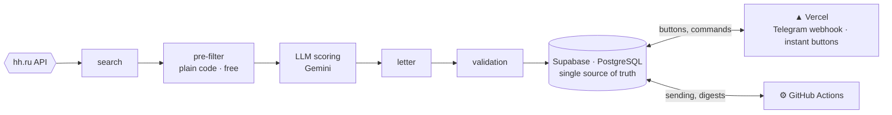
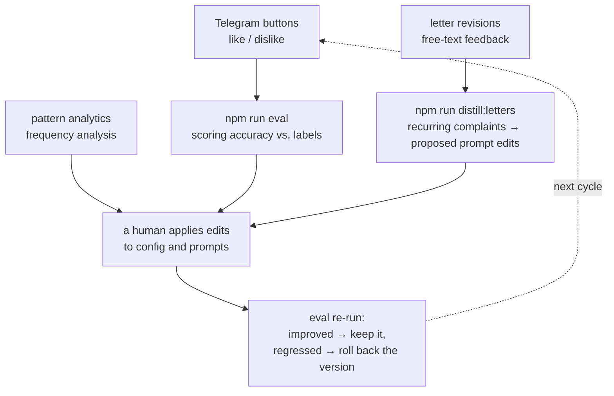

# JobAgent

A personal job-hunting agent for hh.ru. It finds fresh vacancies, scores them against
your profile, writes cover letters, and submits applications — automatically or with a
single tap in Telegram.

What sets it apart from auto-apply bots: the system optimizes for application
*precision*, not volume — and it can prove it works well, instead of just "seeming to
work."

**Language / Язык:** **English** · [Русский](README.md)

---

## The problem

Searching for a job by hand takes an hour or two every day: scroll the listings, filter
out the noise, write a letter for each vacancy, avoid applying twice, remember to check
for replies. On top of that, the first applications to a fresh vacancy get noticeably
more views — and you can't be online the moment it's published.

Existing auto-apply bots solve this with spam: the same template letter sent to
everything. The result is hundreds of applications, zero replies, and a damaged
reputation on the platform.

JobAgent takes the opposite approach: fewer applications, but each one timely, relevant,
and carrying a letter written for that specific vacancy from real résumé facts.

## What it does

1. Polls the hh.ru API across a set of search queries — two full runs a day plus a
   fresh-vacancy sweep every 30 minutes.
2. Filters out obvious mismatches with plain code: stop-words, work format, vacancy age,
   staffing-agency proxies. Free and predictable.
3. Scores the survivors with an LLM: 0–10 score, reasons, risks, which résumé version to
   send.
4. For strong matches, writes a cover letter — strictly from knowledge-base facts, no
   invented metrics or employers.
5. Submits applications in one of three modes: fully manual, veto-with-timeout (default),
   or autopilot.
6. Collects feedback via Telegram buttons and accumulates application-conversion
   statistics.

## Key design decisions

- **Threshold over quota.** The daily cap is a ceiling, not a target. If only three
  vacancies qualify, three go out — not ten padded with junk.
- **Zero fabrication.** Every letter passes a deterministic validator: numbers, links,
  and names must exist in the profile knowledge base.
- **Human in the loop.** By default there's a one-hour veto window before anything is
  sent — one tap in Telegram.
- **No self-training.** The system never rewrites itself. Every change to prompts or
  thresholds is made by a human — and only after a regression check.

## Architecture



Full LLM runs are launched by **GitHub Actions** on a schedule — 2 full runs a day plus
a fresh-vacancy sweep every 30 minutes.

**Why two runtimes.** Heavy LLM runs live in GitHub Actions: built-in scheduling,
long-running jobs, no always-on server needed. Telegram buttons demand instant
responses — that's serverless on Vercel. The two never call each other directly, only
through the database, so either side can be moved or replaced independently.

**Why the official API instead of browser automation.** Selenium and scraping bring
account-ban risk, captchas, and brittle selectors. Instead: the official hh API plus
graceful degradation when it's unavailable:

| Mode | When | What the system does |
|---|---|---|
| **FULL** | API and OAuth work | full automation |
| **NO_OAUTH** | search works, applying doesn't | Telegram card: copy the letter, open the vacancy — two taps |
| **FALLBACK** | API is down entirely | manual link import; scoring and letters keep working |

The mode is chosen by an availability check at the start of every run, and any switch
triggers a notification.

**Why not multi-agent.** The pipeline is linear: search → score → letter → send. A
linear process is orchestrated in code, not agent loops — that keeps behavior
predictable, testable, and free of token-burning planning steps. The LLM here is five
specialized calls with their own prompts and models (scoring, letters, revision,
distillation, onboarding), not "an agent that decides everything itself."

**Two-tier models.** Scoring (dozens of calls a day, simple task) runs on a cheap
Flash-Lite; letters (a few calls, quality matters) run on full Flash. Switching models
is a one-line config change.

## How we verify the system works

- **82 unit tests** covering the deterministic logic: pre-filter, cap selection, letter
  validator, degradation modes, cost accounting, metrics. No network, no external
  APIs — fast and stable.
- **Deterministic letter validator.** The LLM doesn't grade itself: length, banned
  phrases, and fact-checking against the knowledge base are all plain code. A failure
  triggers one automatic regeneration; a second failure sends the letter to manual
  review and blocks submission.
- **Regression evals for scoring.** "Relevant / miss" buttons on every card accumulate
  labels. `npm run eval` replays the current scoring prompt against the accumulated
  labels and computes precision / recall / accuracy. Every prompt edit gets
  regression-tested before it ships.
- **Test-set isolation.** Labels are an exam, not a textbook: they never enter the
  scoring prompt. A dedicated test statically forbids the scorer from reading eval
  data — classic data-leakage protection, enforced in CI.
- **Prompt versioning.** All prompts are files with version numbers; every LLM call logs
  the prompt, version, model, tokens, and cost. You can always tell "I broke the prompt"
  from "the provider updated the model."

## How the system improves over time



Important: the system only gathers data and proposes — a human decides. There is no
automatic self-training, deliberately: on a few hundred labels, any auto-tuning overfits
to noise. For the same reason there's no classical ML (regressions, classifiers): on
small data it loses to LLM zero-shot. The question is revisited at 300+ labels.

## Cost and scaling

The system is designed for minimal cost of ownership: at personal scale it runs entirely
on free tiers. That's a design constraint, not an accident — but every component has a
clear growth path:

| Component | Personal scale | Growth path |
|---|---|---|
| Compute | Scheduled GitHub Actions | queue + workers (SQS / Cloud Tasks) |
| Database | Supabase Free | managed PostgreSQL, replicas |
| LLM | Gemini free tier, key rotation | paid quotas + a fallback provider behind `LLMClient` |
| Users | single user | multi-tenancy (row-level isolation is already in the schema) |
| Interface | Telegram | web dashboard (already in the project) |

Cost accounting is honest: tokens served by free keys are recorded as $0, and pricing
applies only to requests that actually hit a paid key.

## The metrics the system grades itself by

- **Like-rate** — share of liked vacancies among those shown: search and scoring
  precision.
- **Scoring agreement with labels** — precision / recall on the regression eval.
- **Conversion** application → view → interview invite.
- **Revision rate** — how many letters need manual edits. Falling revision rate means
  the writer is improving.
- **Cost per day** — keeps the system honest about staying inside free quotas.

## Stack

| Layer | Technology | Why |
|---|---|---|
| Language | TypeScript (strict) | one language across web, workers, and scripts; types as contracts |
| Web & webhooks | Next.js on Vercel | dashboard and functions in one deploy |
| Workers | GitHub Actions | built-in scheduling, no server to run |
| Database | Supabase (PostgreSQL) | SQL migrations, pgvector for the future |
| LLM | Gemini behind `LLMClient` | structured output, provider swappable via config |
| Tests | node:test | zero extra dependencies, deterministic |

## Quick start

```bash
npm install
npm run typecheck   # strict type checking
npm test            # 82 unit tests
npm run dev         # dashboard on localhost:3000
```

Full setup and deploy instructions: [docs/setup.md](docs/setup.md).

## Status and roadmap

**Now:** the full loop is live — search, scoring, letters, validation, applications via
the manual assistant (NO_OAUTH mode), labeling, regression evals, analytics. Waiting on
hh OAuth access, which unlocks automatic submission and status sync.

**Next:**

- v1: onboarding wizard (LLM extracts the config from a résumé), OAuth from the UI,
  public demo.
- v2: new vacancy sources via the `VacancySource` interface (Habr Career, Getmatch), A/B
  tests for letter styles, ML scoring revisited at 300+ labels.
