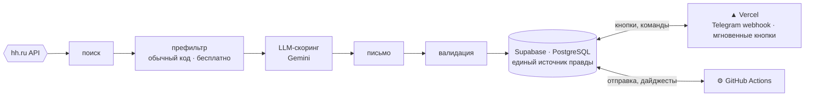
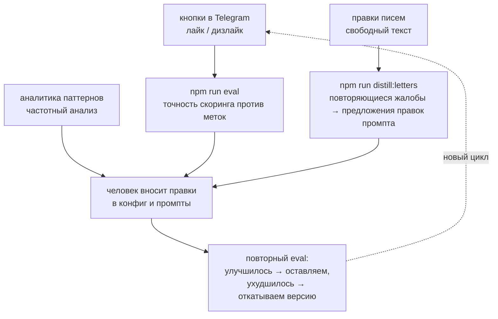

# JobAgent

Персональный агент поиска работы на hh.ru. Находит свежие вакансии, оценивает их
соответствие профилю, пишет сопроводительные письма и отправляет отклики —
автоматически или через одно нажатие в Telegram.

Главное отличие от ботов-откликеров: система оптимизирует не количество откликов, а их
точность — и умеет измерить, что работает хорошо, а не «вроде работает».

**Язык / Language:** **Русский** · [English](README.en.md)

---

## Какую проблему решает

Ручной поиск работы — это час-два в день: пролистать выдачу, отсеять неподходящее,
написать письмо под каждую вакансию, не откликнуться дважды, не забыть проверить ответы.
При этом первые отклики на свежую вакансию получают заметно больше просмотров, а вручную
к моменту публикации не успеть.

Готовые боты-откликеры решают это спамом: шаблонные письма на всё подряд. На выходе —
сотни откликов, ноль ответов и подпорченная репутация на площадке.

JobAgent подходит с другой стороны: откликов меньше, но каждый — вовремя, по делу и с
письмом, написанным под конкретную вакансию из реальных фактов резюме.

## Что делает система

1. Опрашивает API hh.ru по набору поисковых запросов — два полных прогона в день плюс
   опрос свежих вакансий каждые 30 минут.
2. Отбраковывает заведомо неподходящее обычным кодом: стоп-слова, формат работы, возраст
   вакансии, агентства-прокладки. Бесплатно и предсказуемо.
3. Оценивает оставшиеся вакансии через LLM: оценка 0–10, причины, риски, какую версию
   резюме отправить.
4. Для сильных вакансий пишет сопроводительное письмо — только из фактов базы знаний, без
   выдуманных метрик и работодателей.
5. Отправляет отклики в одном из трёх режимов на выбор: всё вручную, вето с таймаутом
   (по умолчанию), автопилот.
6. Собирает обратную связь кнопками в Telegram и копит статистику конверсии откликов.

## Ключевые решения

- **Порог важнее лимита.** Дневной лимит — это потолок, а не план. Если подходящих
  вакансий три, отправляются три, а не десять с мусором в довесок.
- **Ноль выдумок.** Каждое письмо проверяет детерминированный валидатор: числа, ссылки и
  названия обязаны существовать в базе знаний профиля.
- **Человек в контуре.** По умолчанию перед отправкой есть час на вето — одна кнопка в
  Telegram.
- **Никакого самообучения.** Система не подстраивает себя сама. Все изменения промптов и
  порогов вносит человек — и только после проверки на регрессию.

## Архитектура



Полные прогоны с LLM запускает **GitHub Actions** по расписанию — два полных прогона в
день плюс опрос свежих вакансий каждые 30 минут.

**Почему две среды.** Тяжёлые прогоны с LLM живут в GitHub Actions: расписание из
коробки, длинные задачи, не нужен постоянно включённый сервер. Кнопки Telegram требуют
мгновенного ответа — это serverless-функции на Vercel. Среды не вызывают друг друга
напрямую, только через базу: любую из них можно перенести и заменить независимо.

**Почему официальный API, а не браузерная автоматизация.** Selenium и парсинг дают риск
блокировки аккаунта, капчи и хрупкие селекторы. Вместо этого — официальный API hh плюс
продуманная деградация при его недоступности:

| Режим | Когда | Что делает система |
|---|---|---|
| **FULL** | API и OAuth работают | полная автоматика |
| **NO_OAUTH** | поиск работает, отклик недоступен | карточка в Telegram: скопировать письмо и открыть вакансию — два касания |
| **FALLBACK** | API недоступен вовсе | ручной импорт ссылок, скоринг и письма продолжают работать |

Режим выбирается автоматической проверкой доступности в начале каждого прогона, о смене
режима приходит уведомление.

**Почему не multi-agent.** Пайплайн линейный: поиск → оценка → письмо → отправка.
Линейный процесс оркеструется кодом, а не агентными петлями — так поведение
предсказуемо, тестируемо и не жжёт токены на планирование. LLM здесь — пять
специализированных вызовов со своими промптами и моделями (скоринг, письмо, правка,
дистилляция, онбординг), а не «агент, который сам всё решает».

**Двухуровневые модели.** Для скоринга (десятки вызовов в день, простая задача) —
дешёвая Flash-Lite; для писем (единицы вызовов, важно качество) — полноценная Flash.
Смена модели — одна строка конфига.

## Как проверяем, что система работает

- **82 юнит-теста** на детерминированную логику: префильтр, отбор в лимит, валидатор,
  режимы деградации, учёт стоимости, метрики. Без сети и внешних API — быстро и стабильно.
- **Детерминированный валидатор писем.** LLM не проверяет сама себя: длину, стоп-фразы и
  наличие фактов в базе знаний проверяет обычный код. Провал — одна автоматическая
  перегенерация, повторный провал — письмо уходит на ручной разбор и не отправляется.
- **Регрессионные проверки скоринга (evals).** Кнопки «релевантно / мимо» на каждой
  карточке копят разметку. Команда `npm run eval` прогоняет текущий промпт скоринга по
  накопленным меткам и считает precision / recall / accuracy. Любая правка промпта
  проверяется на регрессию до того, как уйдёт в бой.
- **Изоляция тестового набора.** Разметка — это экзамен, а не учебник: она никогда не
  попадает в промпт скоринга. Это закреплено отдельным тестом, который статически
  запрещает скорингу читать данные eval-системы. Классическая защита от утечки данных,
  закреплённая в CI.
- **Версионирование промптов.** Все промпты — файлы с номером версии; каждый вызов LLM
  логирует промпт, версию, модель, токены и стоимость. Всегда можно отличить «я сломал
  промпт» от «провайдер обновил модель».

## Как система улучшается со временем



Важно: система только собирает данные и предлагает — решения принимает человек.
Автоматического самообучения нет намеренно: на паре сотен меток любая автоподстройка
подгонится под шум. По той же причине здесь нет классического ML (регрессии,
классификаторов): на малых данных он проигрывает LLM zero-shot. Возврат к этому вопросу
запланирован на 300+ меток.

## Стоимость и масштабирование

Система спроектирована под минимальную стоимость владения: на персональном масштабе она
работает целиком на бесплатных тарифах. Это ограничение дизайна, а не случайность — но у
каждого компонента есть понятный путь роста:

| Компонент | Персональный масштаб | Рост |
|---|---|---|
| Вычисления | GitHub Actions по расписанию | очередь + воркеры (SQS / Cloud Tasks) |
| База данных | Supabase Free | управляемый PostgreSQL, реплики |
| LLM | Gemini free tier, ротация ключей | платные квоты + запасной провайдер за интерфейсом `LLMClient` |
| Пользователи | один | мультитенантность (изоляция строк уже заложена в схему) |
| Интерфейс | Telegram | веб-дашборд (уже в проекте) |

Стоимость учитывается честно: токены, обслуженные бесплатными ключами, идут в метрики как
$0, прайс применяется только к реальным платным запросам.

## Метрики, по которым система оценивает сама себя

- **Like-rate** — доля лайкнутых вакансий среди показанных: точность поиска и скоринга.
- **Совпадение скоринга с метками** — precision / recall на регрессионной проверке.
- **Конверсия** отклик → просмотр → приглашение.
- **Revision rate** — какую долю писем приходится править вручную. Падает — писатель
  улучшается.
- **Стоимость в день** — контроль, что система остаётся в бесплатных квотах.

## Стек

| Слой | Технология | Почему |
|---|---|---|
| Язык | TypeScript (strict) | один язык на веб, воркеры и скрипты; типы как контракт |
| Веб и webhook | Next.js на Vercel | дашборд и функции в одном деплое |
| Воркеры | GitHub Actions | расписание из коробки, не нужен свой сервер |
| База данных | Supabase (PostgreSQL) | SQL-миграции, pgvector на будущее |
| LLM | Gemini за интерфейсом `LLMClient` | structured output, провайдер меняется конфигом |
| Тесты | node:test | ноль лишних зависимостей, детерминизм |

## Быстрый старт

```bash
npm install
npm run typecheck   # строгая проверка типов
npm test            # 82 юнит-теста
npm run dev         # дашборд на localhost:3000
```

Полная установка и деплой — в [docs/setup.md](docs/setup.md).

## Статус и планы

**Сейчас:** работает полный контур — поиск, скоринг, письма, валидация, отклики через
ручной ассистент (режим NO_OAUTH), разметка, регрессионные проверки, аналитика. Ожидается
OAuth-доступ hh — после него включается автоматическая отправка и синхронизация статусов.

**Дальше:**

- v1: мастер онбординга (LLM извлекает конфиг из резюме), OAuth из интерфейса, публичное
  демо.
- v2: новые источники вакансий через интерфейс `VacancySource` (Habr Career, Getmatch),
  A/B-тесты стилей писем, пересмотр ML-скоринга при 300+ метках.
